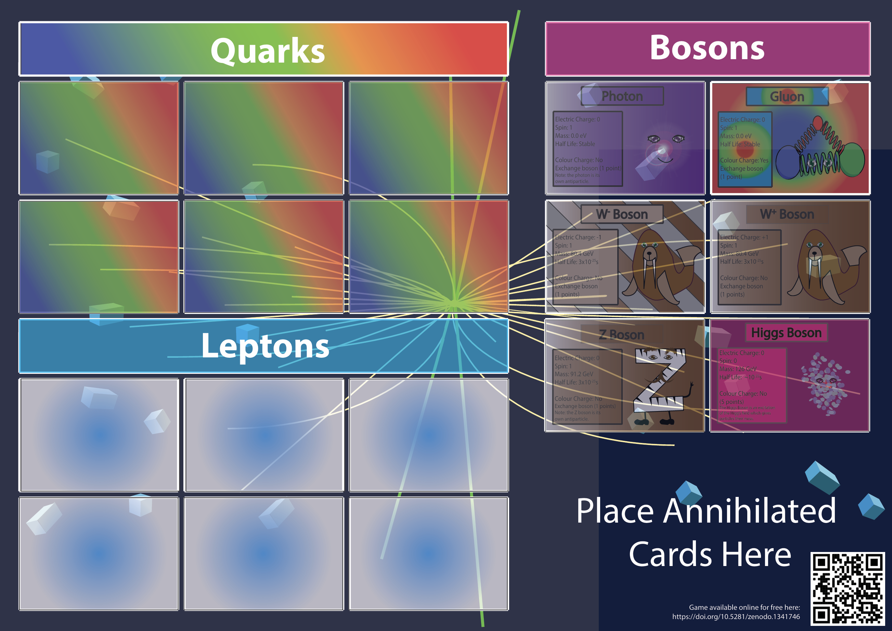
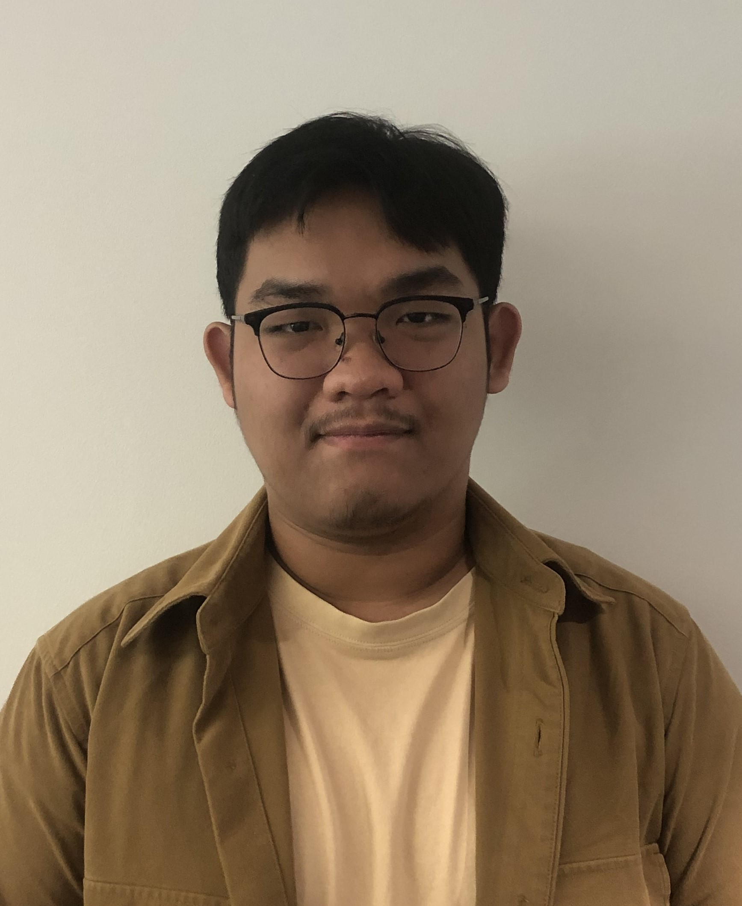
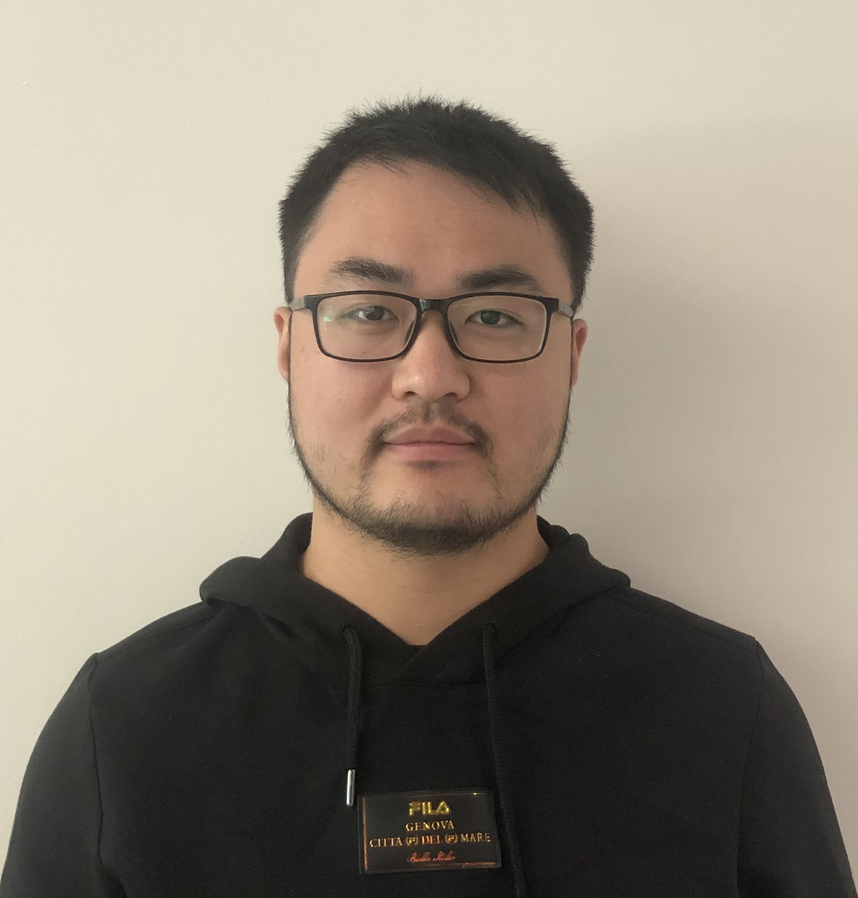
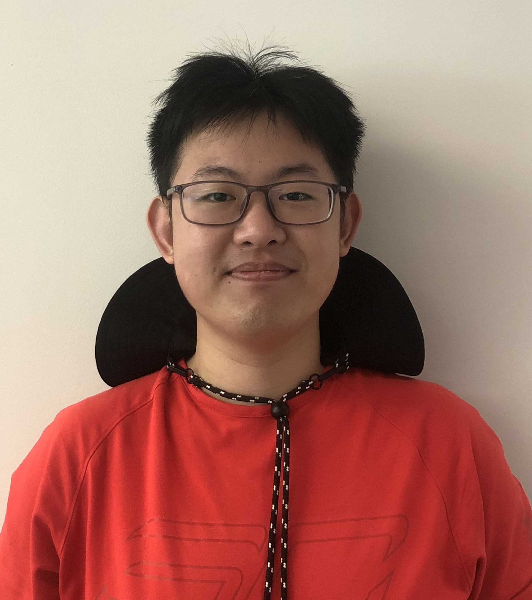
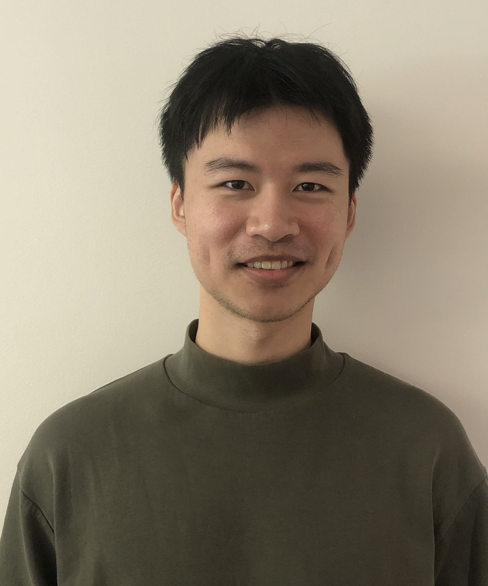

# Particle Builder 🌌

## 🌟 Overview
Welcome to Particle Builder! Our mission is to transform the beloved board game "Particle Builder" into an immersive online experience.

### Version
Version 1.1. Last updated on 02/03/2024

### Developers 
TechLauncher, Australian National University, Australia

### Background 
Particle Builder, a captivating board game designed to educate students about particle physics, has garnered significant attention since its inception. With over 10,000 views, 2,000 downloads, and recognition on [CERN's Website](https://scoollab.web.cern.ch/particle-physics-games), it has proven to be a valuable resource for educators. However, its current format requires extensive setup, including printing, cutting, and laminating, posing a considerable challenge for educators.

### Objective 
Our goal is to streamline the Particle Builder experience by bringing it online. By preserving the original rules and graphics, our aim is to create an accessible digital version. At the minimum viable product (MVP) level, players will engage in level one of the game against a rudimentary computer opponent. Subsequent enhancements may include additional levels, multiplayer functionality, or more sophisticated AI opponents. Upon completion of the MVP, our team intends to conduct extensive evaluations with final year high school students and physics educators across the ACT, culminating in a comprehensive research paper documenting our findings.

## 🚀 Team Introduction
Meet the Team behind Particle Builder:

- **Lachlan McGinness - Client**:  
  [Brief introduction about the team member.]

### Meet the Tech Launcher Team
- **Amy McWilliams - u7253495**:  
  
  Spokesperson. B Software Engineering (Hons)/ B Arts (Linguistics). Experienced in app/ web development, database management and project management. Volunteer STEM teacher. 
- **Andrew Carse - u6666440**:  
  
  [Brief introduction about the team member.]
- **Mohammad Attar (Attar) - u7697826**: 
  
  [Brief introduction about the team member.]
- **Theirry Panggabean (Nicole) - u7697840**:  
  
  [Brief introduction about the team member.]
- **Jiacheng She (Tom) - u7020668**:  
  
  [Brief introduction about the team member.]
- **Zilun Wei (Waylon) - u7220282**:  
  
  Spokesperson. Loves developing games. VR/AR enthusiast. Very familiar with Unity and C#. Likes to learn and practice project management as well.
- **Yeming Chen - u7573153**:  
  
  I'm a current Master of Computing student at ANU, with a background in Mathematics and Statistics from the University of Toronto. Skilled in Java, Python and HTML. I'm also excited to explore game development using Unity.

## 🔗 Guide to Key Links
Make sure to check out these essential links:
- [📚 All Documentation](https://drive.google.com/drive/folders/1gNQTMTf48UgRHE4ytIJuaeIxGWWiEp39)
- [📅 Meetings](https://drive.google.com/drive/folders/1mIbBs1T88vYvBBDxnpUPaGI2cbuYlJ0V)
- [📝 Management and Logs](https://drive.google.com/drive/folders/1xDHlIG2zxgXX8JDGjmVamH--LjQP0a0U)
- [💼 Statement of Work](https://docs.google.com/document/d/1qSa2f-sy6qGiY9qCsEOh26du-j6DDjofjy3XefuoVzk/edit?usp=sharing)
- [🎲 Particle Builder Board Game](https://zenodo.org/records/3594204)

## 📈 Overall Current Progress
Here's a glimpse of our current progress:
- [x] Conducted language research
- [x] Conducted initial logistic research
- [ ] Working on ethics form
- [ ] Working on documentation set up

## 🏆 Milestones 
Our main milestones are: 
- [ ] MVP of game (level one against simple computer available online)
- [ ] Study completed
- [ ] Publication done
- [ ] Game optimization

## 🙏 Acknowledgements
We extend our gratitude to everyone who is helping us as we work towards the completion of this project. In particular, we would like to thank our client (Lachlan McGinness), our teaching team (Rebecca Gordon, Liang Zheng, and Charles Gretton), and our shadow team (Dragonfly Thinking).

## 📄 License
This project is licensed under the CC0-1.0 license. Check the [LICENSE](LICENSE) file for details.
